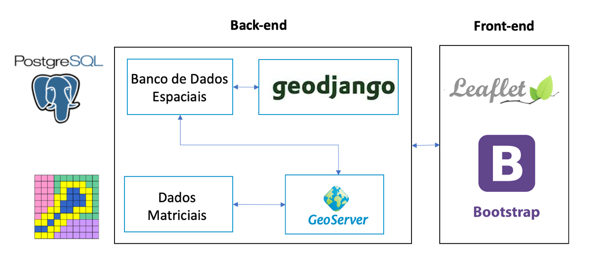

# CAPACITAÇÃO SIGWEB - INSA

## 1. Objetivos:

* Desenvolver as principais competências e habilidades sobre os principais aspectos relacionados à concepção, projeto e o desenvolvimento de sistemas WebGIS.

* Acompanhar a equipe no desenvolvimento do produto, afim de garantir o sucesso da implementação de uma primeira versão do SIG-INSA

## 2. SOBRE O INSTRUTOR 🤓 :

**Marcello Benigno Borges de Barros Filho**

- Engenheiro Civil (UFCG)
- Especialista em Desenvolvimento Web (Unibratec)
- Mestre em Ciências Geodésicas e Tecnologias da Geoinformação (UFPE)
- Professor do Curso Superior de Tecnologia em Geoprocessamento do IFPB desde 2006

Onde me encontrar:

- benigno.marcello@gmail.com ✉️
- [@marcellobenigno](https://twitter.com/marcellobenigno) 🐦 
- [@mbfilho](https://t.me/mbfilho)  telegram 💬

## 3.TECNOLOGIAS UTILIZADAS NESTE PROJETO:

### Django:

 - **Django** é um framework para desenvolvimento rápido para web, escrito em **Python**, que utiliza o padrão Model-View-Template (MVT)
 - **GeoDjango** é o módulo nativo do Django para criar aplicações geográficas

### PostGIS:

- É uma **extensão** espacial do sistema de banco de dados objeto-relacional PostgreSQL
- Permite o armazenamento e manipulação de dados espaciais em um banco de dados objeto relacional

### GeoServer:

- É um servidor de Web Map Service (WMS), Web Coverage Service (WCS) e de Web Feature Service-Transaction (WFS-T) completamente funcional que segue as especificações da Open Geospatial Consortium (OGC).

- O foco do GeoServer é facilitar o uso e suporte para os padrões abertos, a fim de permitir o compartilhamento de suas informações geoespaciais de uma maneira interoperável.

### Leaflet:

- É uma biblioteca JavaScript Open Source  para criação de Web mapas interativos.
- Possui uma série de plugins
- Extremamente leve
- Possui uma boa documentação

### Bootstrap:

- Bootstrap é um framework web com código-fonte aberto para desenvolvimento de componentes de interface e front-end para sites e aplicações web, usando HTML, CSS e JavaScript, baseado em modelos de design para a tipografia, melhorando a experiência do usuário em um site amigável e responsivo.

## 4. AULAS:

#### [Aula 1 - Instalação do Ambiente de Desenvolvimento][1]
#### [Aula 2 - Iniciando com o Django][2]

[1]:docs/instalacao.md
[2]:docs/iniciando-com-django.md
